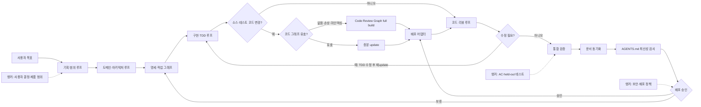
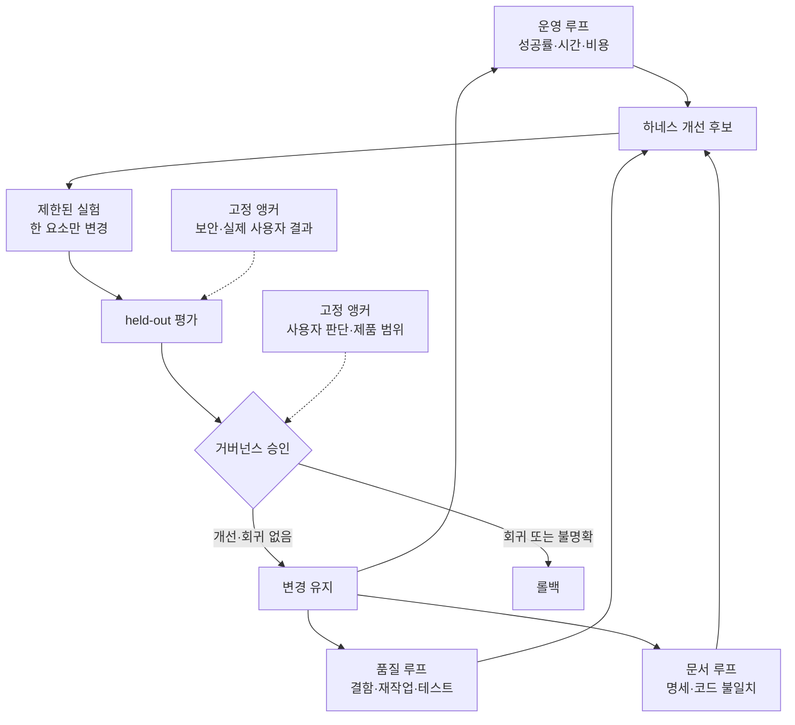

# AI 작업·개선 그래프

Graph Engineering은 작업 순서뿐 아니라 여러 피드백 루프의 권한, 감시 관계, 실행 주기와 고정 앵커를 설계한다.

## 작업 그래프

각 노드는 입력, 출력, 승인 기준, 검증 증거와 종료 상태를 가진다. 의존성이 없는 조사 작업만 병렬화하고, 같은 파일을 수정하는 작업은 병렬화하지 않는다.

## 개선 그래프

## 루프 소유권과 주기

| 루프 | 소유자 | 주기 | 최적화 지표 | 카운터 지표 | 앵커/거부권 |
|---|---|---|---|---|---|
| 기획 | 사용자 | 기능 시작 전 | 명세 완결성 | 범위 증가량 | PRD와 명시적 결정 |
| 구현 | 개발 에이전트 | 작업 항목마다 | AC 통과 | 회귀·변경 크기 | 테스트와 아키텍처 규칙 |
| 리뷰 | 독립 리뷰 관점 | 변경마다 | 발견한 유효 결함 | 오탐·불필요한 리팩터링 | 원 명세와 diff |
| Code Review Graph | 구현 담당자·리뷰 관점 | 코드 변경 묶음 후와 리뷰 게이트 | 변경 영향 탐지율 | update 비용·오탐 | 테스트, 원 명세, AC |
| 문서 | 구현 담당자 | 기능 완료 시 | 코드-문서 일치 | 문서 부피 | 실제 동작과 ADR |
| Agent 규칙 동기화 | 변경 담당자 | 모든 문서 동기화와 릴리스 전 | 링크·명령·규칙 일치 | 중복·단기 상태 유입 | 기준 문서와 사용자 승인 |
| 배포 | 사용자 | 릴리스마다 | 배포 성공 | 장애·롤백 | 사람 승인과 운영 체크 |
| 하네스 개선 | 사용자 | 반복 실패 3회 이상 | 재현 과제 성공률 | 토큰·시간·회귀 | held-out 평가와 롤백 |

빠른 루프는 느린 루프가 소유한 목표를 변경하지 않는다. 구현 루프는 테스트를 통과하기 위해 AC나 테스트를 약화할 수 없고, 하네스 개선 루프는 사용자 승인 없이 고정 앵커를 수정할 수 없다.
