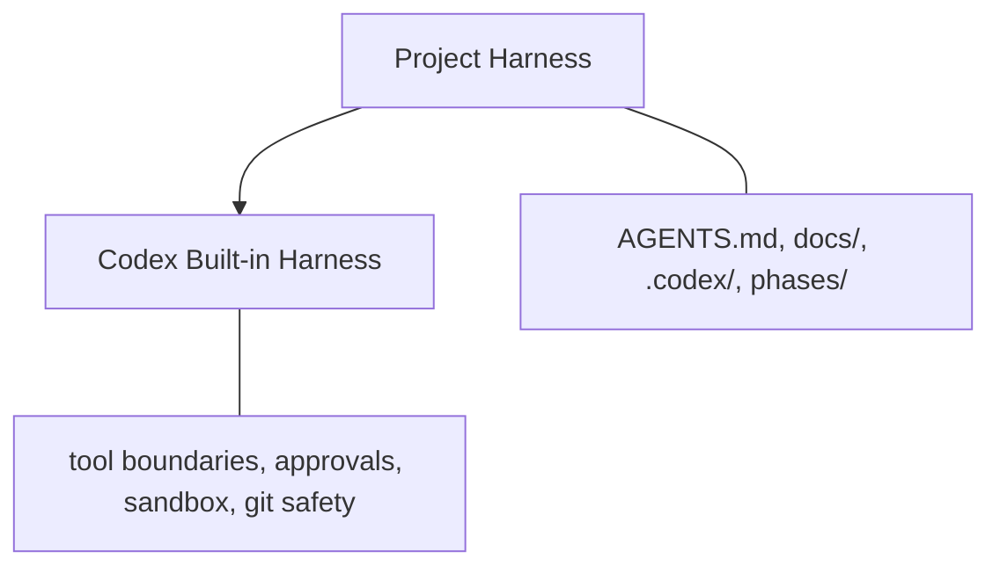

# Harness Framework

Codex가 프로젝트 규칙을 따라 작은 단위로 기능을 구현하도록 돕는 프로젝트 전용 하네스 템플릿입니다. 범용 AI 코딩 도구의 기본 안전장치 위에 `docs/`, `AGENTS.md`, Codex commands, hooks, phase 실행기를 올려 작업 범위와 품질 기준을 명확히 고정합니다.



## 왜 쓰는가

AI가 코드를 잘 쓰게 만드는 핵심은 “프롬프트를 길게 쓰는 것”이 아니라 “프로젝트 맥락을 구조화해서 매번 같은 기준으로 주는 것”입니다. 이 레포는 그 맥락을 문서와 실행 파일로 고정합니다.

- `docs/`는 제품, 아키텍처, 결정 이유, UI 기준을 담습니다.
- `AGENTS.md`는 모든 작업에 적용되는 프로젝트 헌법입니다.
- `.codex/commands`는 계획, 실행, 리뷰의 작업 흐름을 정의합니다.
- `.codex/hooks`는 위험 명령, 테스트 누락, 검증 누락을 자동으로 막습니다.
- `scripts/execute.py`는 phase의 step을 순차 실행하고 상태를 기록합니다.

## 구조

```text
.
├── AGENTS.md
├── .codex/
│   ├── commands/
│   │   ├── harness.md
│   │   └── review.md
│   ├── hooks/
│   │   ├── pre_tool_use_policy.py
│   │   ├── stop_validation.py
│   │   └── tdd_guard.py
│   ├── config.toml
│   └── hooks.json
├── docs/
│   ├── README.md
│   ├── PRD.md
│   ├── ARCHITECTURE.md
│   ├── ADR.md
│   └── UI_GUIDE.md
├── scripts/
│   ├── execute.py
│   └── test_execute.py
└── phases/
    └── {task-name}/
        ├── index.json
        └── step{N}.md
```

`phases/`는 작업 계획을 만들 때 추가됩니다. 처음 클론한 상태에는 없을 수 있습니다.

## 4개 레이어

### Layer 1. `docs/`

프로젝트의 뇌입니다. 구현 전에 가장 먼저 채워야 합니다.

- `PRD.md`: 무엇을 만들지, 무엇을 만들지 않을지
- `ARCHITECTURE.md`: 어떤 구조와 데이터 흐름으로 만들지
- `ADR.md`: 왜 그 기술과 방식을 선택했는지, 어떤 트레이드오프를 감수했는지
- `UI_GUIDE.md`: 화면이 어떻게 보여야 하는지, 어떤 UI 안티패턴을 피할지

특히 `PRD.md`의 MVP 제외 사항과 `ADR.md`의 트레이드오프가 중요합니다. 이 두 항목이 없으면 AI가 범위를 넓히거나 이미 결정한 기술 선택을 흔들 가능성이 커집니다.

### Layer 2. `AGENTS.md`

모든 Codex 작업에 주입되는 프로젝트 규칙입니다.

포함할 내용:

- 기술 스택
- 아키텍처 규칙
- `CRITICAL`로 표시할 절대 규칙
- 테스트 우선 개발 규칙
- 빌드, 테스트, 린트 명령어

`CRITICAL` 규칙은 짧고 구체적으로 씁니다. 예를 들어 “API 키는 환경변수로만 읽고 코드에 하드코딩하지 않는다”처럼 위반 여부를 판단할 수 있어야 합니다.

### Layer 3. 실행 엔진

`.codex/commands/harness.md`는 작업을 phase와 step으로 나누는 기준을 제공합니다. `scripts/execute.py`는 작성된 phase를 순차 실행합니다.

실행기가 처리하는 일:

- `feat-{phase}` 브랜치 생성 또는 checkout
- `AGENTS.md`와 `docs/*.md`를 매 step 프롬프트에 포함
- 완료된 step의 `summary`를 다음 step 컨텍스트로 전달
- 실패 시 최대 3회 재시도
- `started_at`, `completed_at`, `failed_at`, `blocked_at` 기록
- 코드 변경과 실행 메타데이터를 분리 커밋

### Layer 4. Hooks

`.codex/hooks.json`에서 Codex hook을 연결합니다.

- Stop validation: `package.json`에 `lint`, `build`, `test` script가 있으면 순서대로 실행
- Bash policy: `rm -rf`, force push, `git reset --hard`, `DROP TABLE` 같은 위험 명령 차단
- TDD guard: 구현 파일 수정 시 대응 테스트가 없으면 변경 차단

현재 hook은 Windows를 포함한 모든 환경에서 Python 스크립트로 실행됩니다.

## 빠른 시작

1. 프로젝트 이름과 기술 스택을 `AGENTS.md`에 적습니다.
2. `docs/PRD.md`에 목표, 핵심 기능, MVP 제외 사항을 적습니다.
3. `docs/ARCHITECTURE.md`에 디렉토리 구조, 패턴, 데이터 흐름을 적습니다.
4. `docs/ADR.md`에 주요 기술 결정과 트레이드오프를 적습니다.
5. UI가 있는 프로젝트라면 `docs/UI_GUIDE.md`를 구체화합니다.
6. Codex와 논의해 `phases/{task-name}` 아래 step 파일을 만듭니다.
7. 실행기로 phase를 실행합니다.

```bash
python3 scripts/execute.py 0-mvp
```

실행 후 원격 push까지 하려면:

```bash
python3 scripts/execute.py 0-mvp --push
```

Windows에서 `python3` 명령이 없다면 `python scripts/execute.py 0-mvp`처럼 실행합니다.

## Phase 구조

상위 인덱스:

```json
{
  "phases": [
    {
      "dir": "0-mvp",
      "status": "pending"
    }
  ]
}
```

작업 인덱스:

```json
{
  "project": "my-project",
  "phase": "0-mvp",
  "steps": [
    { "step": 0, "name": "project-setup", "status": "pending" },
    { "step": 1, "name": "core-types", "status": "pending" },
    { "step": 2, "name": "api-layer", "status": "pending" }
  ]
}
```

step 파일은 독립 실행 가능한 지시서여야 합니다. “이전 대화에서 말한 것처럼” 같은 표현은 쓰지 않고, 필요한 파일 경로와 제약을 파일 안에 직접 적습니다.

## Step 상태

- `pending`: 아직 실행 전
- `completed`: 완료
- `error`: 자동 재시도 후에도 실패
- `blocked`: 사용자 개입 필요

`completed` step에는 `summary`를 남깁니다. 다음 step에서 컨텍스트로 사용되므로 생성 파일, 핵심 결정, 주의할 점을 한 줄로 적습니다.

## 복구

`error` 상태를 다시 실행하려면:

1. `phases/{task-name}/index.json`에서 해당 step의 `status`를 `pending`으로 바꿉니다.
2. `error_message`를 삭제합니다.
3. 실행기를 다시 실행합니다.

`blocked` 상태를 다시 실행하려면:

1. `blocked_reason`에 적힌 원인을 해결합니다.
2. 해당 step의 `status`를 `pending`으로 바꿉니다.
3. `blocked_reason`을 삭제합니다.
4. 실행기를 다시 실행합니다.

## 문서 작성 원칙

- AI와 함께 기획하되, 최종 제약은 문서에 남깁니다.
- “무엇을 만들지”만큼 “무엇을 만들지 않을지”를 명확히 적습니다.
- 기술 선택은 결정, 이유, 트레이드오프를 같이 기록합니다.
- UI 품질이 중요하면 `UI_GUIDE.md`를 선택 문서로 두지 말고 필수 문서처럼 관리합니다.
- 결과가 마음에 들지 않으면 코드를 직접 고치기 전에 `docs/`와 `AGENTS.md`를 먼저 보강합니다.

## 테스트

실행기 테스트:

```bash
uvx pytest scripts/test_execute.py
```

로컬 Python에 `pytest`가 설치되어 있다면:

```bash
python -m pytest scripts/test_execute.py
```

## FAQ

### 비개발자도 사용할 수 있나요?

가능합니다. 직접 코드를 모두 작성하지 않아도 `docs/`와 `AGENTS.md`를 채우고 Codex와 논의하며 phase를 만들 수 있습니다. 다만 터미널에서 실행기를 돌리고 에러 상태를 확인할 수 있는 정도의 기본 사용법은 필요합니다.

### Phase는 몇 개가 적당한가요?

MVP 기준으로 5-7개 정도가 적당합니다. 너무 적으면 한 step에 많은 작업이 들어가고, 너무 많으면 컨텍스트 관리 비용이 커집니다.

### 결과물이 별로면 어디를 고쳐야 하나요?

대부분은 코드보다 하네스 문서가 먼저입니다. PRD의 범위, ARCHITECTURE의 구조, ADR의 트레이드오프, UI_GUIDE의 시각 기준 중 빠진 항목을 보강한 뒤 다시 실행하는 편이 재현성이 좋습니다.
