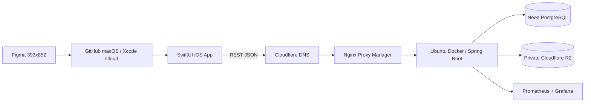

# Money Snap

[](https://github.com/kim946509/moneysnap/actions/workflows/server-ci-cd.yml)
[](https://github.com/kim946509/moneysnap/actions/workflows/ios-ci.yml)

오늘 쓴 돈을 사진처럼 가볍게 남기고, 한 장의 소비 스냅샷으로 돌아보는 iOS 전용 비주얼 소비 기록 앱입니다. 전통적인 숫자형 가계부보다 기록의 재미와 직관성을 우선하며, 모든 기록은 개인 비공개로 시작하고 사용자가 선택한 항목만 그룹에 공유하는 방향을 지향합니다.

<p align="center">
  
</p>

디자인 source of truth는 [Money Snap Figma](https://www.figma.com/design/IDNeYlc3584NY9YhsyUQYE/Money-Snap---Product-Design?node-id=0-1)이며, 구현 화면은 frame `9:2`의 393x852 reference와 macOS Simulator screenshot으로 검수합니다.

## 현재 상태

- `WORK-010` Today Snap 홈 읽기 기반 완료
  - 양의 KRW 정수, MVP 8개 카테고리, 일별 합계와 overflow 보호
  - SwiftUI loading/content/failure 상태와 in-memory client fixture
  - Figma Home의 카드, 금액, 최근 소비, custom tab UI
  - 시각 회귀 기준: MAE `≤ 0.05`, mismatched pixel ratio `≤ 0.43`
- Spring Boot와 iOS CI 활성화, Ubuntu Docker development CD 계약 구성 완료
- Neon dev/prod와 private Cloudflare R2 dev/prod 분리 완료
- 다음 사용자 기능은 인증 정책을 확정한 뒤 시작

현재 Home은 결정론적 fixture를 사용하는 읽기 전용 첫 vertical slice입니다. 인증, PostgreSQL 저장소, 실제 REST 조회·저장, 사진 업로드와 그룹 공유는 아직 구현되지 않았습니다. 단계별 상태는 [개발 계획](docs/DEVELOPMENT_PLAN.md)에서 확인할 수 있습니다.

## 제품 원칙

- 기록은 항상 나만 보기로 시작합니다.
- 공유는 기록 이후 사용자가 명시적으로 선택합니다.
- 금액 비공개는 클라이언트 숨김이 아니라 서버 응답 경계에서 보장합니다.
- 복잡한 통계보다 오늘의 소비를 사진·크기·배치로 빠르게 이해하는 경험을 우선합니다.
- iOS MVP 범위를 벗어난 Android, 웹, 자동 금융 연동, OCR은 추가하지 않습니다.

## 기술 스택

| 영역 | 기술 |
|---|---|
| iOS | iOS 17+, Swift 6, SwiftUI, Swift Concurrency, Observation, PhotosUI, URLSession, SpriteKit |
| API | Java 21, Spring Boot 4.1.0, Gradle 9.5.1, REST/JSON, OpenAPI 3.1 |
| 데이터 | Neon PostgreSQL 18, Spring Data JPA, Flyway, Testcontainers |
| 미디어 | private Cloudflare R2 Standard, backend-authorized short-lived signed grant |
| 개발 배포 | Cloudflare DNS → Nginx Proxy Manager → Ubuntu Docker Spring Boot |
| 관측성 | Spring Boot Actuator, Prometheus, Grafana |
| 자동화 | GitHub Actions server/iOS CI, Ubuntu SSH Docker CD, 향후 Xcode Cloud/TestFlight |



하나의 iOS 앱과 하나의 Spring Boot modular monolith로 시작합니다. 서버는 `identity`, `snap`, `group`, `media` package-by-feature 경계를 따르며, MVP에는 microservice, Kafka, Redis, GraphQL을 도입하지 않습니다. 자세한 결정은 [아키텍처](docs/ARCHITECTURE.md)와 [ADR](docs/ADR.md)을 따릅니다.

## 저장소 구조

```text
ios/                 SwiftUI app, Xcode project, Swift tests, Figma visual references
server/              Spring Boot modular monolith, Gradle, Docker image
contracts/           versioned OpenAPI contract and canonical server/iOS JSON examples
infra/               Neon, Cloudflare, Apple, Ubuntu deployment contracts
docs/                product, policy, architecture, UI and CI/CD sources of truth
.ai/                 work items, loops and project-local AI harness
```

## 빠른 시작

### 서버 테스트와 빌드

Windows PowerShell 기준입니다. 테스트는 실제 Neon에 연결하지 않습니다.

```powershell
cd server
.\gradlew.bat test --no-daemon --console=plain
.\gradlew.bat bootJar --no-daemon --console=plain
```

production JAR은 `server/build/libs/moneysnap-server.jar`로 생성됩니다.

기본 `test`에는 OpenAPI 3.1 parse/reference, `/api/v1`, operation ID, Draft 2020-12 example schema와 runtime error enum drift를 검사하는 semantic contract gate가 포함됩니다. canonical JSON은 `contracts/examples/v1/**` 한 벌을 서버와 iOS consumer test가 함께 사용합니다.

### 서버 실행

서버 실행에는 [server/.env.example](server/.env.example)의 여섯 환경변수가 모두 필요합니다.

- `NEON_RUNTIME_DATABASE_URL`, `NEON_RUNTIME_DATABASE_USERNAME`, `NEON_RUNTIME_DATABASE_PASSWORD`
- `NEON_MIGRATION_DATABASE_URL`, `NEON_MIGRATION_DATABASE_USERNAME`, `NEON_MIGRATION_DATABASE_PASSWORD`

runtime 연결은 Neon pooled endpoint와 최소 권한 app role, Flyway 연결은 direct endpoint와 owner role을 사용합니다. 실제 값은 PowerShell 세션, GitHub environment 또는 저장소에서 제외된 local secret file로만 주입합니다.

```powershell
cd server
.\gradlew.bat bootRun
```

로컬 H2나 상시 Docker Compose PostgreSQL로 자동 대체하지 않습니다. PostgreSQL 통합 테스트가 필요한 기능에서만 Docker 기반 PostgreSQL 18 Testcontainers를 일회성으로 사용합니다.

### iOS 검증

Windows에서는 Xcode를 실행할 수 없으므로 project와 visual baseline 계약을 정적으로 검사합니다.

```powershell
powershell -ExecutionPolicy Bypass -File ios\scripts\validate-project.ps1
powershell -ExecutionPolicy Bypass -File ios\scripts\validate-visual-baseline.ps1
```

macOS 또는 GitHub-hosted `macos-15`에서는 Xcode 16.4, iPhone 16, iOS 18.5 기준으로 native test와 screenshot diff를 실행합니다.

```bash
bash ios/scripts/test.sh
bash ios/scripts/capture-visual-baseline.sh
```

두 번째 명령은 `app`, `reference`, `overlay`, `diff`, `report` artifact를 만들며 검토된 threshold를 넘으면 실패합니다. 배포 signing, archive와 TestFlight는 Apple activation 이후 Xcode Cloud가 담당합니다.

### 저장소 계약 검증

```powershell
powershell -ExecutionPolicy Bypass -File scripts\validate-cicd.ps1
```

## 개발 방식

기능은 [개발 계획](docs/DEVELOPMENT_PLAN.md)의 순서로 진행합니다.

1. `.ai/templates/work-item.md`로 Intent, 범위, Acceptance Criteria와 검증 방법을 고정합니다.
2. 서버·iOS 테스트를 먼저 실패시키고 최소 구현으로 통과시킵니다.
3. 서버 전체 테스트와 iOS native integration test를 실행합니다.
4. UI가 바뀌면 Figma frame별 393x852 screenshot과 정량 diff를 검수합니다.
5. Code Review Graph와 독립 리뷰로 영향·테스트 공백을 확인합니다.
6. 한 기능 단계가 완전히 통과하면 conventional commit으로 기록합니다.

각 기능 단계마다 서버를 배포하지 않습니다. 통합 묶음을 `main`에 병합할 준비가 됐을 때만 development CD를 사용하며, schema 변경은 이전 image와 호환되는 expand-first 방식으로 진행합니다.

## CI/CD

| Workflow | Trigger | 결과 |
|---|---|---|
| [Server CI/CD](.github/workflows/server-ci-cd.yml) | server/contract PR, `main`, manual | test, JAR, immutable Docker image; `main`만 Ubuntu development deploy |
| [iOS CI](.github/workflows/ios-ci.yml) | iOS/contract PR, `main`, manual | Simulator ad-hoc signed native test, unsigned 393x852 visual build |
| Xcode Cloud | Apple workflow | managed signing, archive, internal TestFlight 예정 |

운영 계약과 rollback 경계는 [CI/CD 문서](docs/CI_CD.md), 실제 리소스와 secret 이름은 [인프라 문서](infra/README.md)를 참고하세요.

## 보안

- 실제 `.env`, `.env.*.local`, private key, certificate, provisioning profile과 credential JSON은 커밋하지 않습니다.
- public pull request CI에는 Neon, R2, SSH 또는 Apple secret을 주입하지 않습니다.
- 사진은 private R2 bucket에 저장하고 iOS 앱에 R2 credential이나 영구 object URL을 넣지 않습니다.
- public API hostname에는 management port와 actuator path를 노출하지 않습니다.
- 저장소는 Secret Scanning과 Push Protection을 사용합니다.
- secret을 대화, 로그 또는 commit에 노출했다면 즉시 회전합니다.

## 주요 문서

- [제품 요구사항](docs/PRD.md)
- [서비스 정책](docs/SERVICE_POLICY.md)
- [사용자 흐름](docs/USER_FLOW.md)
- [화면 구조](docs/SCREEN_STRUCTURE.md)
- [UI 가이드](docs/UI_GUIDE.md)
- [아키텍처](docs/ARCHITECTURE.md)
- [기술 결정 기록](docs/ADR.md)
- [기능 개발 계획](docs/DEVELOPMENT_PLAN.md)
- [CI/CD 운영 계약](docs/CI_CD.md)
- [인프라 계약](infra/README.md)
- [AI 개발 환경](docs/AI_ENVIRONMENT.md)
