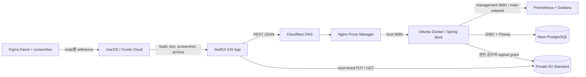
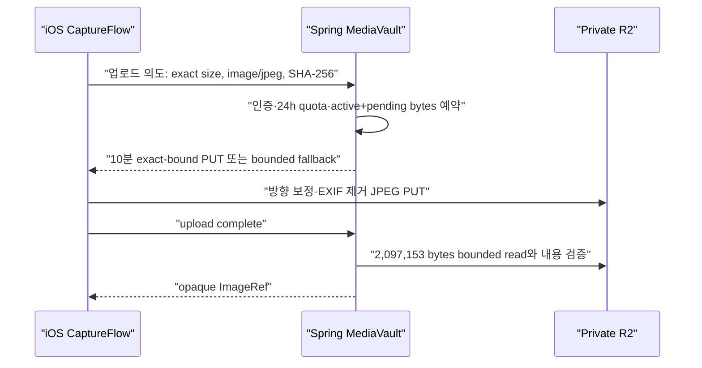

# Money Snap 아키텍처

> 상태: accepted baseline
>
> 기준일: 2026-08-13

## 목표

- Figma 기준 iPhone 화면을 SwiftUI로 높은 정합도로 구현한다.
- 소비 기록은 항상 개인 기록으로 먼저 저장하고 공유는 별도 명령으로만 수행한다.
- 금액 비공개 그룹은 서버 응답 타입에서 금액과 금액 기반 크기 신호를 제거한다.
- Spring Boot 배포 위치와 object storage를 Adapter로 격리해 무료 폐쇄형 MVP에서 공개 origin으로 이동할 수 있게 한다.
- 작은 team과 낮은 사용량에 맞춰 하나의 iOS app, 하나의 Spring Boot deployable, 하나의 PostgreSQL로 시작한다.

## 전체 구조



무료 단계 origin은 개발자 소유 Ubuntu Docker host이며 기존 Nginx Proxy Manager가 HTTPS를 application port `9090`으로 전달한다. 이 topology는 폐쇄형 TestFlight에만 사용한다. 공개 출시 단계에서는 `EDGE → NPM → API` 구간을 Cloudflare Tunnel, Container 또는 별도 managed JVM origin으로 교체하고 API·DB·R2 Interface는 유지한다.

## 저장소 구조

```text
ios/                        # SwiftUI app, asset catalog, Swift tests, Xcode project
server/                     # Java 21 + Spring Boot + Gradle
contracts/
└── openapi/                # iOS와 API가 공유하는 versioned HTTP Interface
infra/
├── neon/                   # dev/prod project, 역할과 secret 계약
├── apple/                  # Apple Developer/App Store Connect 준비 계약
├── cloudflare/             # DNS/R2/향후 Containers 준비와 배포 설정
└── ubuntu/                 # Docker origin, rollback과 monitoring scrape 계약
docs/                       # 제품·기술 기준 문서
.ai/                        # AI 작업·검증 루프
```

`server/` scaffold는 Windows에서 test와 production JAR build를 통과했다. `ios/` project는 Windows 정적 검증과 GitHub-hosted Xcode 16.4·iPhone 16/iOS 18.5 native test, Home/My 393x852 Simulator visual evidence를 통과했다. 이후 iOS 기능도 같은 macOS gate 전에는 native 완료로 판정하지 않는다.

## iOS Module

| Module | 좁은 Interface | 숨기는 Implementation |
|---|---|---|
| `AuthenticationClient` | `signIn`, `restore`, `refresh`, `logout`, `deleteAccount` | AuthenticationServices, Keychain, bearer token rotation, Apple credential state |
| `CaptureFlow` | 사진 없음 또는 사진 한 장을 가진 개인 Snap 저장 완료까지 | 카메라 1장, PhotosPicker 최대 3장, 이미지 방향 보정·리사이즈·EXIF 제거, 사진별 순차 처리, upload grant와 retry |
| `SnapJournalClient` | `today`, `record`, `revise`, `delete` | URLSession, bearer session, OpenAPI DTO, 오류 정규화 |
| `GroupSharingClient` | `groups`, `share`, `groupToday`, `memberToday` | membership API와 visible/hidden projection decoding |
| `MoneySnapVisualSystem` | 반복되는 color, type, spacing, tab, sheet, Snap object | Figma token, SF Symbol, asset catalog와 accessibility variant |
| `TodayCanvas` | 의미 데이터와 stable layout seed | SpriteKit scene, 낙하·충돌, reduce-motion fallback |

SwiftUI View는 R2 URL 생성, HTTP endpoint, JSON key, group 권한 규칙을 알지 않는다. preview와 snapshot에서는 production HTTP Adapter를 `InMemoryBackendAdapter`로 교체한다.

완전한 offline sync는 MVP에서 제외한다. 아직 전송하지 못한 현재 draft는 로컬에 보존할 수 있지만, server commit 전에 공유된 Snap으로 표시하지 않는다.

## Spring Boot Module

`server`는 package-by-feature modular monolith다.

```text
com.ansandy.moneysnap
├── identity/               # actor와 session, 외부 identity 검증
├── snap/                   # 개인 기록·수정·삭제·오늘 projection
├── group/                  # membership·선택적 공유·공개 정책 projection
├── media/                  # upload intent·R2 grant·삭제 정리
└── shared/                 # Money, IDs, Clock 등 작고 안정된 공통 값
```

각 feature는 `api → application → domain` 방향으로 호출하며 persistence와 외부 SDK Adapter는 feature 내부에 둔다. 다른 feature의 repository나 entity를 직접 참조하지 않고 application Interface를 호출한다. 범용 `service`, `util`, `repository` 패키지에 도메인 규칙을 모으지 않는다.

### 핵심 Interface와 불변 규칙

`IdentitySession`

- identity provider는 Sign in with Apple 하나이며 iOS의 identity token과 authorization code를 서버에서 검증·교환한다.
- access token은 15분, rotating refresh session은 마지막 정상 사용으로부터 180일 뒤 만료한다.
- refresh token 원문은 DB에 저장하지 않고 단방향 hash만 저장한다. 재사용이 탐지된 token family는 전체 폐기한다.
- iOS는 refresh credential을 Keychain에만 저장하고 session 복구가 끝나기 전 인증 화면을 결정하지 않는다.
- 로그아웃은 현재 session만 폐기한다. 계정 탈퇴는 재인증 후 모든 session과 사용자 데이터를 삭제하고 Apple token을 revoke한다.
- Apple `consent-revoked`는 모든 session을 폐기하고, `account-deleted`는 사용자 데이터 삭제 command를 실행한다.
- Apple이 첫 로그인에서 제공한 이름은 trim 후 1~30 grapheme cluster일 때만 저장하고, 없거나 유효하지 않으면 `MoneySnap 사용자`를 사용한다. 이름 편집과 profile 사진은 MVP에서 제외한다.

`SnapJournal`

- `record`는 group ID나 visibility를 입력받지 않고 개인 Snap만 만든다.
- 금액은 `1...999,999,999 KRW` 양의 정수로 저장하며 부동소수점을 사용하지 않는다.
- `localDay`는 server `Clock` instant를 제출한 tzdb region `ZoneId` 또는 `UTC`로 변환한 current day·직전 day만 허용한다. numeric offset·short alias·미래·2일 이전은 거부하고 저장 후 수정하지 않는다.
- `revise`는 가격과 카테고리만 바꾼다.
- `delete` 성공 직후 개인·그룹 projection에서 Snap이 사라지고 media 삭제는 재시도 가능한 작업으로 넘긴다.
- client mutation ID로 record와 share의 중복 실행을 막는다. 동일 record replay는 동적 날짜 재검증보다 먼저 최초 결과를 반환한다.

`GroupSharing`

- 공유는 durable personal Snap에 대해서만 별도 수행한다.
- 한 share command는 Snap 1개와 group 1개만 대상으로 record와 다른 mutation ID를 사용한다. 취소·실패는 personal Snap을 rollback하지 않는다.
- 현재 membership을 매 요청 확인한다.
- 같은 Snap·group 반복 공유는 멱등 성공이다.
- amount-visible 응답과 amount-hidden 응답은 다른 DTO다. hidden DTO에는 amount, total, amount-derived size와 order가 존재하지 않는다.
- 그룹은 owner 한 명과 member, owner 포함 최대 20명이다. 이름은 trim 후 1~30 grapheme cluster이며 같은 owner가 중복 이름의 다른 그룹을 만들 수 있다.
- amount visibility는 생성 시 고정하고 변경 command를 두지 않는다.
- owner는 member 제거·그룹 삭제, member는 self-leave만 수행한다. 그룹 lifecycle은 share를 삭제하지만 personal Snap을 삭제하지 않는다.
- 대표 Snap은 member별 해당 날짜의 최신 `sharedAt`을 사용하고, 사진이 없으면 category별 고정 icon/color placeholder를 사용한다.
- 초대는 최소 128-bit entropy의 원문을 hash로만 저장하고 168시간 뒤 만료한다. 그룹당 active code는 하나이며 reissue는 이전 code를 폐기한다.

`MediaVault`

- object key는 서버가 만들고 client 입력을 경로로 사용하지 않는다.
- 한 Snap에는 active image를 최대 1개만 연결한다. JPEG는 최대 변 `1600px`, `2,097,152 bytes` 이하이고 EXIF를 제거해야 한다.
- grant는 정확한 `image/jpeg`, byte size와 SHA-256을 받고, 최근 24시간 completed+nonexpired pending 20건과 active+pending+신규 `7,000,000,000 bytes`를 transaction으로 검사한다. 삭제는 24시간 quota를 환급하지 않는다.
- upload intent와 grant는 10분 뒤 만료한다. complete된 `ACTIVE_UNLINKED` media는 `completedAt`부터 24시간 동안 같은 사용자의 draft 복구를 위해 보존하고, explicit abort 또는 `completedAt + 24시간` 이후에만 orphan cleanup claim 대상이 된다. expired·failed pending, invalid·eligible orphan object와 삭제 실패는 cleanup job이 bounded retry한다.
- iOS가 R2에 직접 업로드한 뒤 `complete`가 private object를 최대 `2,097,153 bytes`로 bounded read해 signature·dimension·size·checksum·EXIF 제거를 확인해야 image를 활성화한다.
- direct PUT이 exact length·type·checksum을 실제 강제하지 못하면 unrestricted grant 대신 Spring Boot bounded stream upload를 사용한다.
- 읽기 grant도 소유자 또는 현재 group member를 확인한 뒤 발급한다.
- public bucket, 영구 URL, 앱 내 R2 credential을 금지한다.

## API 경계

- canonical Interface는 `contracts/openapi/moneysnap-v1.yaml`이 소유한다.
- wire example은 `contracts/examples/v1/**` 한 벌을 OpenAPI, server provider test와 iOS consumer test가 함께 사용한다. Apple 인증·event request는 호환성을 위해 future field를 허용한다. 상태를 변경하는 Snap·group·share command는 operation schema에 선언되지 않은 field를 국소적으로 거부한다. 전역 Jackson strict mode는 사용하지 않으며 response와 공용 error는 schema의 exact field set을 지킨다.
- path는 `/api/v1`으로 versioning하고 예상 가능한 오류는 안정된 code와 correlation ID를 반환한다.
- iOS는 생성되거나 검증된 typed client를 `SnapJournalClient` 뒤에서 사용한다.
- 존재하지 않는 자원과 접근할 수 없는 자원은 외부에서 구별되지 않는 `NOT_ACCESSIBLE`로 정규화한다.
- controller는 인증 actor와 request DTO를 application command로 바꾸는 일만 한다. 공개 정책·소유권은 domain/application Module에서 검사한다.
- health, metrics, actuator 상세 endpoint는 public mobile API hostname에 노출하지 않는다.

## 데이터 모델 기준

```text
users
apple_identities(user_id, apple_subject, encrypted_apple_refresh_token, created_at, updated_at)
identity_sessions(id, user_id, access_token_hash, access_expires_at, refresh_expires_at, last_used_at, revoked_at)
identity_refresh_tokens(id, session_id, token_hash, status, expires_at, used_at, created_at)
snaps(id, owner_id, category, amount_won, local_day, image_id?, created_at, updated_at)
groups(id, owner_id, name, amount_visibility, created_at)
group_memberships(group_id, user_id, role, joined_at)
group_invites(id, group_id, code_hash, issued_at, expires_at, revoked_at)
snap_shares(snap_id, group_id, shared_at, unique(snap_id, group_id))
media_objects(id, owner_id, object_key, status, byte_size, checksum, expires_at, created_at)
mutation_ledger(actor_id, mutation_id, result_ref, unique(actor_id, mutation_id))
cleanup_jobs(kind, target_id, attempts, next_attempt_at)
```

- `snaps`가 원본이고 `snap_shares`는 관계다. 공유용 Snap 복제본을 만들지 않는다.
- `image_id`는 불투명 식별자이며 permanent URL을 저장하지 않는다.
- `local_day`는 client의 tzdb region ID 또는 `UTC`와 local date를 받아 server `Clock` 기준 current day·직전 day인지 검증한 뒤 고정한다. numeric offset과 short alias는 허용하지 않는다.
- group name은 trim 후 1~30 grapheme cluster, owner 포함 membership은 20개 이하이며 amount visibility는 생성 후 불변이다.
- active invite는 group당 하나만 존재하고 원문이 아닌 hash만 저장한다. membership capacity check와 insert는 하나의 transaction이 소유한다.
- owner account deletion은 owned group과 그 share를 먼저 제거하고 account cascade는 owner의 personal Snap을 삭제한다. group lifecycle만으로 다른 member의 personal Snap을 지우지 않는다.

## 사진 흐름



Snap 저장은 사진 없는 경로 또는 활성 `ImageRef` 하나만 허용한다. 카메라 한 장 또는 앨범 최대 3장은 각각 독립된 Snap으로 순차 저장한다. DB transaction과 R2 operation을 하나의 transaction처럼 가장하지 않는다. 미완료 upload intent, invalid object, explicit abort 또는 24시간 복구 창이 끝난 unlinked object와 삭제 실패는 `cleanup_jobs`로 bounded retry한다. record/link와 cleanup은 같은 media row의 조건부 claim으로 경합해 이미 연결된 object를 삭제하지 않는다.

계정 탈퇴 transaction은 사용자의 pending·active·linked media object key와 회계 정보를 account-independent cleanup row로 먼저 옮긴 뒤 user-owned DB data를 삭제한다. R2 삭제 성공을 확인한 뒤에만 active byte를 줄이고, 실패는 bounded retry하며 다른 owner object는 보존한다.

## 보안과 개인정보 경계

- `IdentityVerifier`는 Apple issuer, audience, signature, nonce와 token lifetime을 검증한다. iOS app에 Apple private key나 추출 가능한 고정 secret을 넣지 않는다.
- Apple refresh token은 서버에서 암호화해 저장하고 암호화 key는 저장소 밖 runtime secret으로 주입한다. Money Snap refresh token은 hash만 저장한다.
- 모든 개인 Snap 조회는 owner를 조건에 포함하고, 모든 group 조회는 membership을 조건에 포함한다.
- 금액 비공개는 UI hide가 아니라 server projection과 DTO schema에서 강제한다.
- 초대 원문은 URL path·query·access log·analytics에 넣지 않고 인증된 join POST body로만 받으며 server에는 hash만 저장한다.
- 가격, token, presigned URL query, 원본 사진명, DB URL을 log·analytics에 남기지 않는다.
- 사진 변환 시 위치를 포함한 불필요한 metadata를 제거한다.
- public Nginx Proxy Manager는 application `9090`만 전달하고 management `9091`과 actuator path는 외부에 노출하지 않는다.
- R2, DB, SSH credential은 저장소에 넣지 않고 최소 권한 secret으로 주입한다.
- 외부 배포, secret 등록, DNS 변경, 유료 플랜 활성화는 별도 release 승인을 요구한다.

## 무료 운영 guardrail

- R2 Standard만 사용하고 Images transformation, Data Catalog, R2 SQL, multipart upload는 MVP에서 비활성화한다.
- 사진은 최대 변 `1600px`, `2,097,152 bytes`, 사용자별 최근 24시간 completed+nonexpired pending 20건으로 제한하고 서버가 모든 upload grant와 complete에 적용한다.
- DB가 추적하는 active media bytes와 nonexpired pending reserved bytes가 신규 예약을 포함해 `7,000,000,000 bytes`를 넘거나 이미 이 값 이상이면 신규 upload grant를 중지한다. 읽기·삭제와 사진 없는 Snap 저장은 유지한다.
- 사진 삭제는 최근 24시간 count quota를 환급하지 않는다. object 삭제가 확인된 뒤에만 active storage bytes에서 제거한다.
- Class A/B 추정량과 R2 dashboard 사용량을 대조하고 60/70% 알림을 둔다.
- Cloudflare budget alert는 다음 날 발송되는 정보성 알림이며 hard cap이 아님을 운영 문서에 명시한다.
- 자동 과금을 기술적으로 완전히 차단할 수 없는 resource는 사용자 승인 없이 생성하지 않는다.
- self-hosted 무료 단계는 신원을 아는 10~20명 내외, 최대 4~8주 폐쇄형 TestFlight로 제한한다.

## 테스트 전략

### Backend

- domain Interface에서 실패 테스트를 먼저 작성한다.
- PostgreSQL 18은 테스트 실행 중에만 Testcontainers로 기동해 실제 constraint, Flyway migration, transaction과 projection을 검증한다.
- 소유자·비회원·탈퇴 회원·hidden group에 대한 부정 권한 테스트를 필수로 둔다.
- R2는 `InMemoryObjectStoreAdapter`로 domain test를 실행하고, 실제 R2-compatible contract test는 승인된 integration 환경에서 분리한다.
- 실제 R2-compatible test는 exact PUT length·type·checksum, `2,097,153 bytes` overflow, complete content verification과 invalid object cleanup을 검증한다. exact boundary를 강제할 수 없으면 backend bounded fallback이 같은 실패 테스트를 통과해야 한다.
- group integration test는 owner 포함 20명 capacity, single active 168시간 invite, reissue revoke, join replay/atomicity와 visibility 불변을 검증한다.
- 기본 Gradle `test`에서 OpenAPI 3.1 parse/reference, `/api/v1`, nonblank unique operation ID, Draft 2020-12 schema와 format assertion, canonical external fixture containment, 공용 ErrorResponse/runtime enum drift를 검증한다. controller success/error exact field set과 iOS decode도 같은 fixture를 사용한다.

### iOS

- `InMemoryBackendAdapter`를 사용한 Swift Testing으로 사진 없음과 사진별 순차 CaptureFlow, Home 단일-group share action과 화면 state를 TDD한다.
- 각 화면은 Figma node와 같은 fixture로 393x852 snapshot을 생성한다.
- 지정 Simulator/OS에서 XCUITest로 기록, 수정·삭제, 저장 후 공유, visible/hidden group을 검증한다.
- reduce motion, Dynamic Type, VoiceOver label과 touch target을 별도 확인한다.

### 변경 영향

- 애플리케이션 소스나 테스트가 처음 생기면 `code-review-graph`가 없으므로 full build한다.
- 이후 의미 있는 코드 변경 묶음마다 고정 base로 incremental update하고, 영향 분석에서 찾은 테스트 공백을 같은 TDD loop에서 처리한다.
- graph는 테스트와 Figma visual diff를 대체하지 않는다.

## iOS build와 배포 lane

- Windows: Spring Boot build/test, Swift source와 project file 작성, Figma asset 준비, CI/CD 정적 검증.
- GitHub-hosted Ubuntu CI: Java 21 test·bootJar와 digest-pinned Docker image archive를 만들며 Neon/SSH/Apple secret을 주입하지 않는다.
- GitHub-hosted Ubuntu CD: 성공한 `main` image만 pinned SSH Ubuntu origin에 전송하고, `server-development`의 Neon·Apple runtime secret으로 `/opt/moneysnap/runtime.env`를 다시 쓴 뒤 container health 실패 시 이전 image와 같은 release secret으로 rollback한다.
- GitHub-hosted `macos-15`: iOS·contract 변경에만 Apple 개발 credential·provisioning 없이 Simulator unit+non-parallel UI test를 Xcode 기본 ad-hoc 서명으로 실행하고, Keychain을 쓰지 않는 visual evidence app은 한 번만 unsigned build/install해 manifest의 모든 화면을 순차 검증한다.
- GitHub-hosted `macos-26` TestFlight CD: 성공한 `main` iOS CI 또는 `main` manual dispatch만 `ios-testflight` App Store Connect API key와 Xcode 26 / iOS 26 SDK로 archive/upload한다. PR과 iOS test job에는 이 secret을 넣지 않는다.
- macOS/Xcode: SwiftUI preview, screenshot diff, interactive debugging. 첫 TestFlight 업로드에 Mac이 필요하지는 않다.
- interactive pixel tuning은 GitHub archive lane만으로 완료할 수 없으므로 실제 또는 원격 Mac 세션이 필요하다.

세부 trigger, environment secret, checksum, health와 rollback 계약은 `docs/CI_CD.md`가 소유한다. DNS, Nginx Proxy Manager와 monitoring 설정은 application CD가 만들거나 재시작하지 않는다.

## 금지할 구조

- SwiftUI View에서 직접 R2·DB·Cloudflare API 호출
- public R2 bucket 또는 장기 presigned URL
- group amount를 client가 받은 뒤 숨기기만 하는 구현
- 기록과 group 공유를 하나의 command로 결합
- Worker와 Spring Boot에 인증·권한·도메인 규칙을 중복
- D1 proxy Worker를 JPA database처럼 사용
- ephemeral container/local disk에 DB·사진·session 영구 저장
- 개발 편의를 위한 상시 Docker Compose PostgreSQL과 dev/prod DB 공유
- 기능별 microservice, Kafka, Redis, realtime socket을 근거 없이 선도입
- macOS build·snapshot evidence 없이 iOS 작업을 완료 처리
- MVP 범위 밖 알림을 위해 APNs provider, device token table 또는 background job을 추가

## 배포 전환 기준

다음 중 하나면 self-hosted 무료 origin을 종료하고 public origin 결정을 연다.

- 공개 App Store 심사 또는 지인 밖 사용자 모집
- DAU 20 또는 등록 사용자 100 초과
- 30분 이상 장애 1회 또는 한 주 사용자 영향 장애 2회
- p95 API 응답 500ms 초과가 지속되거나 upload 성공률 99% 미만
- RPO 24시간 또는 RTO 4시간을 만족하지 못함
- Ubuntu host 운영에 주 1시간 이상 소비
- 예상 R2/DB 사용량이 무료 범위의 70% 도달

Cloudflare Containers 채택 시 월 최소 5 USD, 예상 memory/CPU/disk, `sleepAfter`, max instance 1, 외부 PostgreSQL latency를 실제 부하로 검증하고 별도 승인한다.
